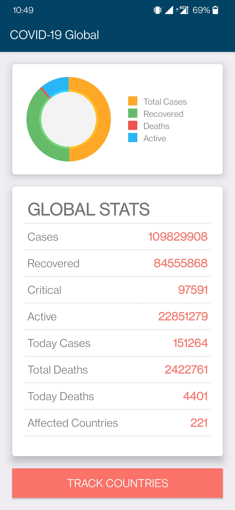

# Covid19_Android_Dashboard_App
Android application for displaying COVID19 case statistics and tracking global as well as country-wise data using live dataset.

## Motivation
Coronavirus disease (COVID-19) is an infectious disease caused by a newly discovered coronavirus. 
The best way to prevent and slow down transmission is to be well informed about the COVID-19 virus, the disease it causes and how it spreads. 
The Android application aims to gather the data of COVID19 spread across the globe as well as individually affected countries and make information more accessible. 
The statistics displayed are the total number of confirmed cases, total number of deaths, total number of recovered cases, total number of active cases, total number of critical cases, daily cases and deaths, and number of affected countries. All
these data are visualized into a pie-chart form. 
It aggregates and analyses the live data available on COVID-19 to help the users respond to the pandemic by getting the statistics of their country on daily basis.

<b>Dataset API for global data:</b> https://corona.lmao.ninja/v2/all

<b>Dataset API for country-wise data:</b> https://corona.lmao.ninja/v2/countries

## Screens
<table>
  <tr>
    <td></td>
    <td></td>
  </tr>
  <tr>
    <td></td>
    <td></td>
  </tr>
</table>
 
